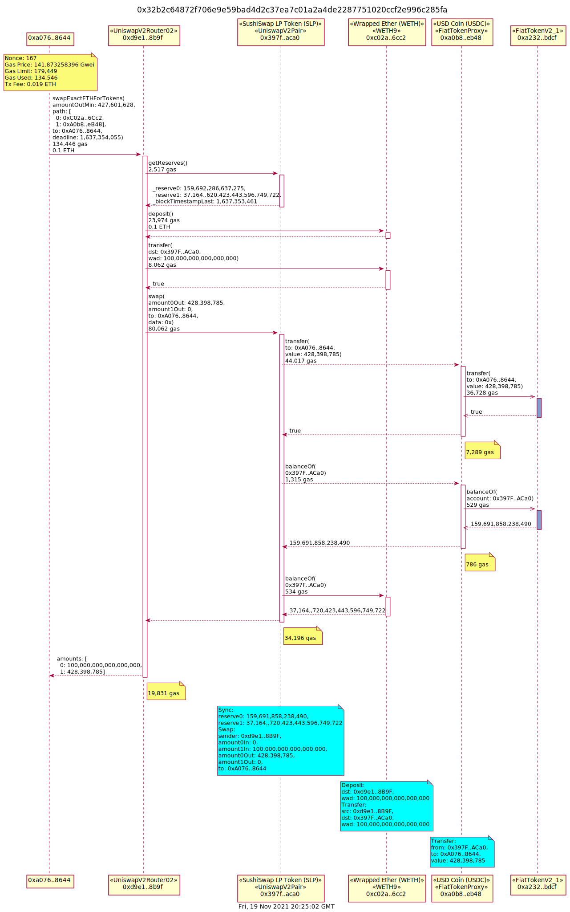

# metrics
> Dune Analytics / Google BigQuery SQL Queries for OpenMEV/Sushi Relay

[https://dune.xyz/manifold/Manifold-Finance](https://dune.xyz/manifold/Manifold-Finance)


## Anatomy of a Gas Rebate





### Assumptions 

maxPriorityFeePerGas= 2.5 Gwei

> See Appendix 1 for how this is calculated

```js
  maxPriorityFeePerGas = BigNumber.from("2500000000");
```

- Miner Bribe = maxPriorityFeePerGas * 1.00175
- Miner Fees: (original transaction gas fee) + **[ Miner Tip (bribe) ]**
- User Eligible Rebate: (original transaction gas fee / 80% Confidence Gas Level )
- Sushi Payouts =  **[ Miner Tip (bribe) ]** + **[User Eligible Rebate]**


- Gas Rebate Normalized Total Cost: 

- maxPrice    
Highest priced transaction in the mempool    

- currentBlockNumber    
Block number at the time of prediction

- msSinceLastBlock    
Milliseconds since the last block was mined relative to when data was computed    

- blockNumber    
Block this prediction is for    

- baseFeePerGas    
Base fee per gas for current block in gwei. (Only type2 transactions Post EIP-1559 have this value and it's burned by the network upon transaction success).    

- estimatedTransactionCount    
Number of items we estimate will be included in next block based on mempool snapshot    

- confidence    
0-99 likelihood the next block will contain a transaction with a gas price >= to the listed price.  

## SushiSwap

```json
{ 
  "contractCall.methodName": [ 
            "swapETHForExactTokens", 
            "swapExactETHForTokens", 
            "swapExactETHForTokensSupportingFeeOnTransferTokens",
            "swapExactTokensForETH", 
            "swapExactTokensForETHSupportingFeeOnTransferTokens",
            "swapExactTokensForTokens", 
            "swapExactTokensForTokensSupportingFeeOnTransferTokens", 
            "swapTokensForExactETH",
            "swapTokensForExactTokens"
  ] 
}
```


## Appendix 1
[see hackmd]
